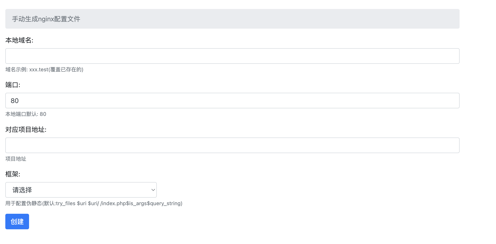

## gii-nginx

- 生成nginx本地配置文件(可视化)
  

#### 1.准备工作

    - 新增本地域名指向当前目录 gii-nginx.test 指向/youpath/gii-nginx
    - 访问gii-nginx.test
    - 如上图为正常
    - 保证当前的终端用户有读写文件的权限,打开PHP终端命令shell_exec函数(一般是支持的)

#### 2.配置
    - 修改gii.php的$ectHost变量,本机host文件绝对路径(注意需要打开文件的可读写权限,没有权限需要手动加入)
    - 修改gii.php的$nginxHostPath变量,改成你自己的NGINX vhosts存放目录的绝对路径
    - 新增成功编辑本地host文件将新增的域名加上映射
    - 重启一下nginx(手动nginx -s reload)
